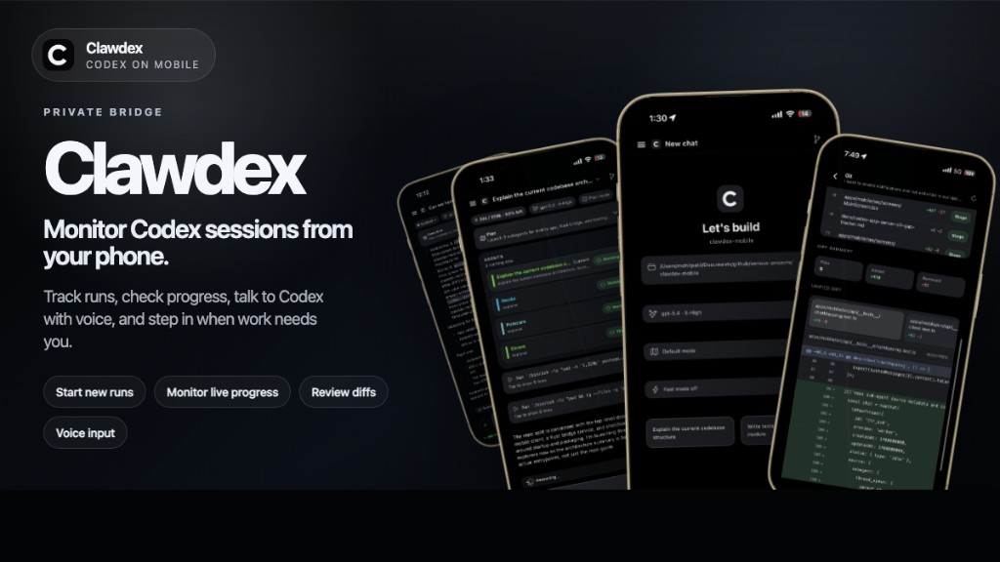

# remote-claw

<p align="center">
  
</p>

Run Claude Code from your phone.

`remote-claw` is a source-first mobile client plus local bridge for Claude Code. You run the bridge on your computer, then connect the mobile app from your phone over local LAN using the printed token.

This project is for trusted/private networking only. Do not expose the bridge publicly.

This repo has two parts:

- `app/`: an Expo / React Native mobile app
- `bridge/`: a small TypeScript server that spawns `claude` and streams messages to the app over HTTP + WebSocket

## What You Get

- Mobile chat for Claude Code
- Live streamed assistant output over WebSocket
- In-app tool permission approval and denial
- Interrupt support while Claude is thinking
- Configurable working directory per session
- A simple local bridge you can run on your own machine

## Quick Start

Typical local flow:

```bash
npm run setup
./start.sh
npm run app
```

## How It Works

1. The bridge starts a local server on your computer.
2. The mobile app connects to that bridge using your machine's IP/hostname and an auth token.
3. The bridge creates Claude Code sessions and forwards:
   - your messages from the phone to `claude`
   - streamed assistant output back to the phone
   - permission prompts back to the phone so you can allow or deny tool use

## Repo Layout

```text
.
├── app/       # Expo app
├── bridge/    # Claude Code bridge server
└── start.sh   # helper to start the bridge
```

## Before You Start

- Node.js and npm
- Claude Code CLI installed and available on `PATH`
- iOS Simulator, Android emulator, or a physical device with Expo Go / dev build

Install Claude Code CLI if needed:

```bash
npm install -g @anthropic-ai/claude-code
```

Install dependencies for both packages:

```bash
npm run setup
```

Start the bridge:

```bash
npm run bridge
```

Or use the helper script:

```bash
./start.sh
```

When the bridge starts, it prints:

- the local server URL
- the auth token
- the working directory Claude will use by default

Then start the app:

```bash
npm run app
```

For a simulator:

```bash
npm run ios
npm run android
```

## Connecting From Your Phone

Make sure your phone and computer are on the same network, then enter these values in the app:

- `Bridge Host`: your computer's LAN IP or hostname, like `192.168.1.100` or `macbook.local`
- `Port`: `4567` by default
- `Auth Token`: the token printed by the bridge on startup
- `Working Directory`: the directory Claude should operate in, like `~/Developer/my-project`

The app does a health check before connecting. After that it opens a WebSocket session and starts streaming Claude responses.

## Scripts

### Root

```bash
npm run setup      # install deps in bridge and app
npm run bridge     # start the bridge in dev mode
npm run app        # start Expo
npm run ios        # start Expo for iOS
npm run android    # start Expo for Android
npm run typecheck  # typecheck bridge and app
```

### Bridge

```bash
cd bridge
npm run dev        # run src/index.ts with tsx
npm run build      # compile to dist/
npm run start      # run compiled bridge
```

### App

```bash
cd app
npm start
npm run ios
npm run android
npm run web
```

## Bridge Environment Variables

The bridge supports these environment variables:

- `TANU_PORT`: server port, default `4567`
- `TANU_HOST`: bind host, default `0.0.0.0`
- `TANU_CWD`: default working directory for new Claude sessions
- `TANU_AUTH_TOKEN`: auth token for the mobile app; if unset, one is generated on startup

Example:

```bash
TANU_HOST=0.0.0.0 TANU_PORT=4567 TANU_CWD=~/Developer npm run bridge
```

## API Notes

The bridge exposes:

- `GET /health` for connectivity checks
- `POST /sessions` to create a Claude session
- `GET /sessions` to list active sessions
- `DELETE /sessions/:id` to end a session
- `WS /ws/:sessionId?token=...` for realtime chat streaming

## Development Notes

- The app stores the last connection config in local storage.
- Permission requests from Claude tools are shown in-app and can be approved or denied from the phone.
- There is currently no dedicated test suite; use `npm run typecheck` for a basic verification pass.

## Troubleshooting

If the app cannot connect:

- make sure the bridge is running
- make sure the host is your computer's reachable LAN IP, not `localhost`
- make sure the token matches exactly
- make sure your phone and computer are on the same network
- make sure `claude` is installed and works from your terminal

If session creation fails:

- check that `TANU_CWD` or the app's working directory exists
- verify Claude Code CLI can run in that directory
